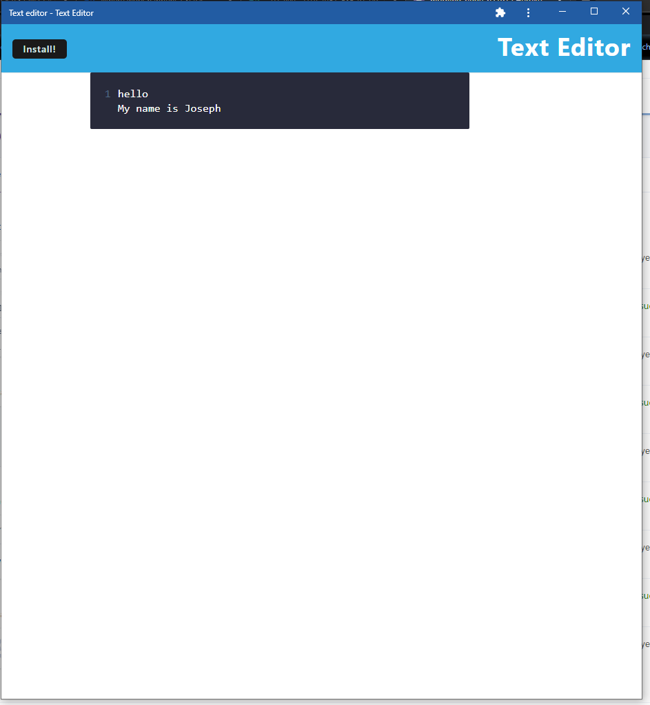

# Simple-text-Editor

## Description
* This is a simple PWA text editor
* The user can edit and modify the text.
* The text will be saved to and InexedDB
* The text will be retrieved from the the DB
* Text saves on hitting enter or if the text area loses focus
## Links
* Deployed site: https://morning-ridge-62197.herokuapp.com/
* Github:  https://github.com/IRiceKrispie/Simple-text-Editor

## Screenshots

